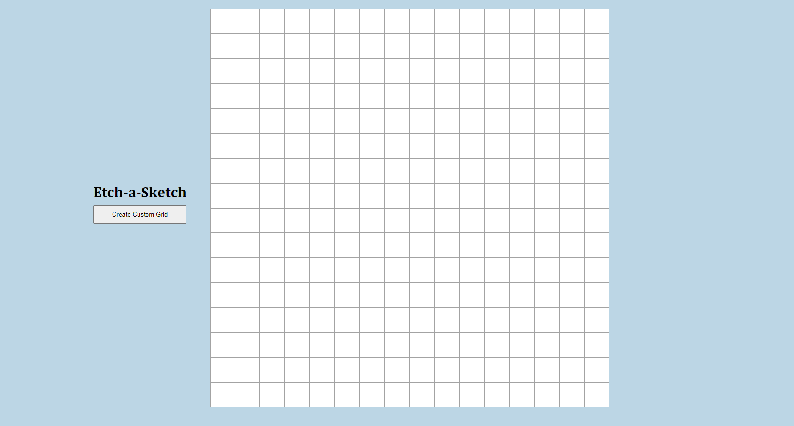
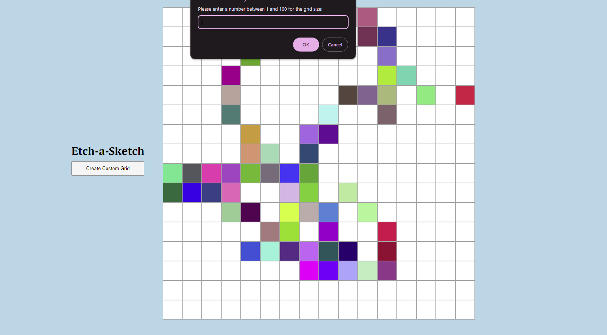

# Etch-a-Sketch
## Overview
The purpose of this project is to build an Etch-a-sketch program that allows us to draw in the web browser.

## Screenshots

## Source
The project is based on [Foundations: Etch-a-Sketch on The Odin Project](https://www.theodinproject.com/lessons/foundations-etch-a-sketch)